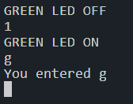

# Serial Input

# Contents
- [Serial Input](#serial-input)
- [Contents](#contents)
- [Introduction](#introduction)
- [Project](#project)
  - [Setup](#setup)
  - [Complete Code](#complete-code)
  - [Downsides](#downsides)

# Introduction

The aim of this tutorial is to demonstrate how to send data over the UART to the board.

You can either create your own project and follow along or import this repository into [Keil Studio Cloud](https://studio.keil.arm.com/) by following the instructions [here](https://github.com/QUB-ARM-STM32/User-Guide/blob/master/KeilStudioCloud/README.md#importing-a-project).

It is recommended to complete the [Serial Output tutorial](https://github.com/QUB-ARM-STM32/Serial-Output) before attempting this one.

# Project

This project is a simple example of how to send data over the UART to the board. We will toggle an LED depending on the character that we enter.

## Setup

To get started we will need to declare a new `BufferedSerial` object. This will allow us to send data out over the UART as needed. Before main add the following.

```cpp
static BufferedSerial pc(USBTX, USBRX);
```

`USBTX` and `USBRX` define the correct pins that the USB UART can use to send and receive data over between the board and the PC. If you are connecting to some other device ensure to set your own pins accordingly.

Next we can set up the `DigitalOut` of our LED pin as below:

```cpp
DigitalOut greenLED(LED1);
```

Next we will define a buffer that we can use to store one character in.

```cpp
char* buffer = new char[1];
```

Finally we can get to our main method, inside the `while` loop we will first call the `read` method on our `BufferedSerial` object.

```cpp
pc.read(buffer, 1);
```

This is a blocking method so it will pause the program while it waits for a character to be entered. Once a character is entered it will be stored in the `buffer` variable.

Next we can check the value of the character and toggle the LED accordingly.

```cpp
if (*buffer == '1'){
    greenLED = 1;
    printf("\r\nGREEN LED ON\r\n");
}
else if (*buffer == '0'){
    greenLED = 0;
    printf("\r\nGREEN LED OFF\r\n");
}
else{
    printf("\r\nYou entered %c\r\n", *buffer);
}
```

In this example I have set the LED to turn on when the character `1` is entered and turn off when the character `0` is entered. If any other character is entered it will print out the character that was entered.

Build and run the program, then open the serial monitor and enter a `1` or `0` to toggle the LED on and off.



## Complete Code

The complete code for this tutorial can be found [here](./main.cpp).


## Downsides

This method of reading data from the serial port is not ideal as it uses a blocking method. Another issue is that using the serial monitor we can only send one character at a time. This is because the serial monitor sends the data as soon as you enter it. While it is possible to use interrupts similar to STM32CubeIDE, it is too complex for this tutorial.